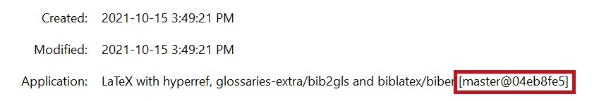

# A LaTeX Cookbook

[](https://forthebadge.com)
[](https://forthebadge.com)

---

> [Remember, a few hours of trial and error can save you several minutes of looking at the README.](https://twitter.com/iamdevloper/status/1060067235316809729)

---

This repo contains a [LaTeX](https://en.wikipedia.org/wiki/LaTeX) [document](cookbook.tex), usable as a cookbook (different "recipes" to achieve various things in LaTeX) and also as a template.
The resulting PDF covers LaTeX-specific topics and instructions on compiling the LaTeX source using Docker.
It is available for [**download**](https://collaborating.tuhh.de/alex/latex-git-cookbook/-/jobs/artifacts/master/raw/cookbook.pdf?job=tex).

This very README is also made available for [download as a PDF](https://collaborating.tuhh.de/alex/latex-git-cookbook/-/jobs/artifacts/master/raw/README.pdf?job=README.pdf), converted from Markdown using [pandoc](https://pandoc.org/) with the [*Eisvogel*](https://github.com/Wandmalfarbe/pandoc-latex-template) template.

## git

[Version control](https://www.atlassian.com/git/tutorials/what-is-version-control#benefits-of-version-control) (we use, like virtually everyone nowadays, [git](https://thenewstack.io/tutorial-git-for-absolutely-everyone/)) is very important: it allows to roll back to healthy versions of projects, and it goes hand in hand with collaboration ([GitLab](https://about.gitlab.com/)/[GitHub](https://github.com/)) as well as backups ([remotes](https://www.atlassian.com/git/tutorials/syncing)).

## Advantages

Some advantages of using version control (specifically, git, but most is applicable to others as well) are lined out below.

### [SSOT](https://en.wikipedia.org/wiki/Single_source_of_truth) (*Single Source Of Truth*)

No more file trees looking like:

```text
directory
│   a.txt
│   help.me.please
│   Important-Document_2018_version1.pdf
│   Important-Document_2018_version2.pdf
│   Important-Document_2018_version3_final.pdf
│   Important-Document_2018_version3_final_really.pdf
│   Important-Document_2018_version3_final_really_I-promise.pdf
│   Important-Document_2018_versionA.pdf
│   Important-Document_2019-03-56.pdf
│   Important-Document_2019-03-56_corrections_John-Doe.pdf
│   Important-Document_2019-03-56_corrections_John-Doe_v2.pdf
│   invoice.docx
│   test - Copy (2).tex
│   test - Copy.tex
│   test.tex
│
└───old_stuff
        Screenshot 1999-09-03-15-23-15(1).bmp
        Screenshot 1999-09-03-15-23-15(2).bmp
        Screenshot 1999-09-03-15-23-15(3).bmp
        Screenshot 1999-09-03-15-23-15(3)_edited.bmp
        Screenshot 1999-09-03-15-23-15.bmp
```

Instead, there is one [*working copy*](https://stackoverflow.com/questions/36201342/git-where-exactly-is-the-working-directory) looking like:

```text
directory
│   .git (a hidden directory)
│   a.txt
│   Important-Document.pdf
└───Properly-Named-Invoice.docx
```

assuming that `a.txt` is actually needed.
**All the old junk and redundant copies have been pruned**.
However, **nothing was lost**.
The entire history is contained within [git](https://en.wikipedia.org/wiki/Git).
The history is readily summoned anytime, if so required.
Git calls this its [*log*](https://www.atlassian.com/git/tutorials/git-log).
Git works best (some would say only) on text-based files, but it can deal with images, PDFs *etc.*, too.

The history and everything else git needs is contained in its `.git` directory, which is hidden on both Linux and Windows.
**Do NOT mess with this directory directly: interact with git only through its command interface**.
Everything else in `directory`, so in this case `a.txt`, `Important-Document.pdf` and `Properly-Named-Invoice.docx`, is accessible as usual.
**There is no difference to how you would normally work with these files.**
They are on your local disk.
Together, they are called the *working tree*.

Therefore (provided that git is used correctly):

1. duplicate files are gone,
2. the art of cumbersome file naming will finally be forgotten,
3. old stuff can be safely deleted; this cleans up the working tree and makes it clear which files are no longer needed.
    Only the currently needed files are visible, the rest is (retrievable!) history.

### File Versioning

Everything is versioned.
Outputs (e.g. PDFs in the case of LaTeX) can be matched to the source code that generated them exactly.
Important states can be [tagged](https://www.atlassian.com/git/tutorials/inspecting-a-repository/git-tag) and found again easily.

### Collaboration

Each contributor has a version of the source on their local machine.
Adjustments are made there, and sent to a [central, online repository](https://www.atlassian.com/git/tutorials/syncing) if they are considered ready to be published.
Git can also be used in a distributed fashion (its original strong suit), but we assume a remote repository on a platform like GitLab or GitHub.
Developers can then also fetch the latest changes from the remote and incorporate them into their local copy.

Do not confuse GitHub, GitLab and others with the tool itself, git.
Microsoft's GitHub is not synonymous to git.
A crude, mostly wrong analogy would be: OneDrive is the platform you do collaboration, version control and sharing on.
This is like GitHub (GitLab, ...).
Office programs like Microsoft Word are used to create original content.
This is like source code, as created in some editor of your choice.
Word's built-in revision history, in conjunction with the process of naming files, for example `2020-05-13_Invoice_John-Doe-Comments_Final.docx` ([ISO-8601](https://en.wikipedia.org/wiki/ISO_8601) oh yeah), would be git.
It "only" does the version control, but is not a *platform* for source code.

### Backups

The remote repository also serves as a back-up solution.
So do all the distributed local copies.
At all points, there will be a workable copy *somewhere*.
In general, git makes losing data extremely hard.
When (not if!) you get into a fight with git about merging, pulling, rebasing, conflicts and the like, think of it as git protecting you and your work.
Often, the reason for git "misbehaving" and making a scene is because it flat-out refuses an operation that would destroy unsaved changes.
In the long run, this behavior is the desired one, as opposed to losing unsaved (git lingo: *uncommitted*) data.

### Branching

Branches, essentially deviating paths in development, are at the heart of git.
In git, they are lightweight constructs and not as heavy as in for example SVN.
You can experiment liberally using [branching](https://www.atlassian.com/git/tutorials/using-branches), combine and split ideas, files etc.

### Bug Fixing

Bug fixing can be accelerated through `git bisect`, a search algorithm that helps pinpoint commits (stages of development) that introduced regressions.
If you know that something is broken today but worked two weeks ago, and there are say 80 commits in your history since then, [bisection](https://interrupt.memfault.com/blog/git-bisect) helps you find the culprit much, much faster than manually testing 80 versions.


## Getting Started

Download for [Windows here](https://git-scm.com/download/win).
Install it and spam *Next* without reading the installation and warning prompts, as always.
For Linux, `apt-get update && apt-get install --yes git` or whatever.
You likely have it available already.

Then, somewhere on your machine (example for Linux), see also [here](https://www.atlassian.com/git/tutorials/setting-up-a-repository):

```bash
# Create empty directory
$ mkdir test
# Go there
$ cd test
# Set up your git credentials; this will show as the 'Author' of your work
$ git config --global user.name "Foo Bar"
$ git config --global user.email "foo@bar.com"
# Initialize an empty git repository
$ git init
Initialized empty Git repository in ...
# Create some dummy file
$ echo "Hello World!" > test.txt
$ git status
On branch master

No commits yet

Untracked files:
  (use "git add <file>..." to include in what will be committed)
        test.txt

nothing added to commit but untracked files present (use "git add" to track)
# Rather listen to what we're being told. The dot adds everything:
$ git add .
# There is now a change! The file is ready to be committed, aka "saved" into
# the history.
$ git status
On branch master

No commits yet

Changes to be committed:
  (use "git rm --cached <file>..." to unstage)
        new file:   test.txt
$ git commit -m "Initial file!"
[master (root-commit) 3aaded0] Initial file!
 1 file changed, 0 insertions(+), 0 deletions(-)
 create mode 100644 test.txt
# Have a look at the history up to here:
$ git log --patch
commit 3aaded0365524e9c0cf7c3bc3cb72e1e993def74 (HEAD -> master)
Author: Foo Bar <foo@bar.com>
Date:   Mon Sep 28 15:29:25 2020 +0200

    Initial file!

diff --git a/test.txt b/test.txt
new file mode 100644
index 0000000..de39eb0
Binary files /dev/null and b/test.txt differ
```

And that is the gist of it.
Next, you would want to create a project on GitLab or similar and connect that to
your local repository.
You can then sync changes between the two, enabling collaboration (or a bunch of other
advantages if you keep to yourself).

### Graphical Interfaces

There are [numerous git GUIs](https://git-scm.com/download/gui/windows) available.
For example, they are great at visualizing the commit history (which can get convoluted, especially if you're doing it wrong), but also offer all the regular CLI functionality in GUI form (try [*a dog*](https://stackoverflow.com/a/35075021/11477374) for terminal log visualization).
[Git for Windows](https://git-scm.com/download/win) comes with a built-in GUI as well, but it's basic:


Modern, popular IDEs like [VSCode](https://code.visualstudio.com/) have native git support and also offer [git extensions](https://marketplace.visualstudio.com/search?term=git&target=VSCode&category=All%20categories&sortBy=Relevance) which should satisfy all needs.
They might look like:


## GitLab

GitLab is a platform to host git repositories.
Projects on there can serve as git remotes.
As mentioned, in this sense, it is like Microsoft's GitHub, the first large website to offer such a service (still by far the largest today).
We use GitLab here because <https://collaborating.tuhh.de> is GitLab *instance* and therefore freely available to university members.
GitLab is a company with their own GitHub competitor at <https://gitlab.com>, the source code of which is also open source and therefore be self-hosted (as done in the case of <https://collaborating.tuhh.de>).

GitLab offers various features for each project.
This includes a Wiki, an issue tracker and pull request management.
Pull requests (PRs for short; GitLab calls these *Merge Requests*) are requests from outside collaborators who have *forked* and subsequently worked on a project.
Forking projects refers to creating a full copy of the project in the own user space of collaborators.
As such, they can then work on it, or do whatever else they want.
If for example they add a feature, their own copy is now ahead of the original by that feature.
To incorporate the changes back to the original, the original repository's maintainers can be *requested* to *pull* in the changes.
This way, anyone can collaborate and help, without ever interfering with the main
development in the original.

### Continuous Delivery (CI)

Continuous Delivery refers to continuously shipping out the finished "product".
In the case of LaTeX for example, these are the compiled PDFs.
This is done with the help of so-called *Docker containers*.
The advantages are:

- collaborators no longer rely on their local tool chain, but on a unified, common, agreed-upon one.
  It is (usually) guaranteed to work and leads to the same, reproducible, predictable results for everyone.

  Docker (also usable locally, not only on the GitLab platform) helps reproduce results:
  - across space: results from coworkers in your office or from half-way across the globe.

     You no longer rely on some obscure, specific machine that happens to be the only one on which compilation (PDF production) works.
  - across time: if fixed versions are specified, Docker images allow programs, processes pipelines etc. from many years ago to run.
- If LaTeX documents become very long, full compilation runs can take dozens of minutes.
  This is outsourced and silently done on the remote servers, if Continuous Delivery is used.
  As such, for example, every `git push` to the servers triggers a [*pipeline*](https://docs.gitlab.com/ee/ci/pipelines/) which compiles the PDF and offers it for download afterwards.
  The last part could be called *Continuous Deployment*, albeit a very basic version.

#### Enable Runner for the project

To build anything, we need someone to build *for* us.
GitLab calls these build-servers [*runners*](https://docs.gitlab.com/runner/).
Such a runner does not materialize out of thin air.
Luckily, in the case of *collaborating.tuhh.de*, runner `tanis` is available to us.
Enable it (him? her?) for the project on the GitLab project homepage: `Settings -> CI/CD -> Runners -> Enable Shared Runners`.
Otherwise, the build process will get 'stuck' indefinitely.

#### Add git info to PDF metadata

After retrieving a built PDF, it might get lost in spacetime.
That is, the downloader loses track of what commit it belongs to, or even what release.
This is circumvented by injecting the git SHA into the PDF metadata.
This allows you to freely hand out PDFs to people, for example for proof-reading or to editors of journals.
You will be able to associate and pinpoint their remarks to a specific, reproducible version of the document.
Note though that such a revision process is (much, much) better done using Pull Requests, provided the other party uses git and GitLab.

To identify versions in git, every object is uniquely identified by its hash
([SHA256](https://stackoverflow.com/a/28792805/11477374)):

```text
412ba291b6980ab21f912b5cdf01a13c6268d0ed
```

It is convenient to abbreviate the full SHA to a short version:

```text
412ba291
```

Since a collision of even short hashes is essentially impossible in most use cases, we can uniquely identify states of the project by this short SHA.
This is why commands like `git show 412ba291` work.
So if we have this SHA available in the PDF, never again will there be confusion about versions.
The PDF will be be assignable to an exact commit.
It can look like this (in Adobe Reader, evoke file properties with `CTRL + D`):



Using this approach, it is hidden and will not show up in print.
You can of course also add the info to the document itself, so that it will be printed.

#### Add PDF Download Button

On the top of GitLab project pages, *badges* may be added.
That's how GitLab calls the small, clickable buttons.
They can be used as a convenient way for downloading built artifacts, e.g. PDFs.
It might look like (bottom row):


A little image (`svg` format) can be generated using [shields.io](https://shields.io/).
That only needs to be done once.
The result might look like:


To add them to a project, navigate to: `Settings -> General -> Badges`.
Give it a `Name`, enter a file path (within the repo) or URL for the `Badge image URL` (or do whatever you want here), and finally enter the `Link`.
This part is a bit tricky, since we need a dynamic URL that adapts to our path.
For this, GitLab provides [variables like `%{project_path}`](https://docs.gitlab.com/ee/user/project/badges.html#placeholders).
As such, a URL might look like (the hyphen in the middle is intentional):

```bash
https://collaborating.tuhh.de/%{project_path}/-/jobs/artifacts/%{default_branch}/raw/document.pdf?job=build_pdf
```

The `project_path` is just your project with its namespace, like `peter/thesis`, the `default_branch` is usually just `master`.
It visits the job artifacts on `master` and gets the `PDF` of the supplied filename.
This filename has to be adjusted accordingly.

Note that the download is **unavailable** while a job is running.
To avoid this, work on a git branch and leave `master` alone.
Treat the PDF (or whatever it is) on `master` as the current stable version that only changes sometimes, not at every commit.
For example, you can do your continuous business on a `dev` branch and then add a second button.

## Possible issues and pitfalls

Many nights were lost over issues involving GitLab CI/CD, but also plain LaTeX.
Here is a non-exhaustive list --- a bit like a gallery of failure --- of the most common ones.
Hopefully, it spares you some despair.

- You run into [a similar error as](https://tex.stackexchange.com/q/233583/120853):

  ```plaintext
  ! Package pgfplots Error: Sorry, the requested column number '1' in table 'dat.
  csv' does not exist!? Please verify you used the correct index 0 <= i < N..
  ```

  This can happen if you use `pgfplotstable` for plotting from tabular data, be it
  inline or from an outside file.
  If you use [`matlab2tikz`](https://github.com/matlab2tikz/matlab2tikz), you might also
  run into the above error, since it potentially uses inline tables.

  In the [class file](cookbook.cls#983), there is a line reading:

  ```tex
  \pgfplotstableset{col sep=comma}% If ALL files/tables are comma-separated
  ```

  This is a *global* default for all tables, assuming that they are comma-separated.
  The default is whitespace, which `matlab2tikz` uses, hence it breaks.
  You can override the column separator either in the above global option, or manually
  for each plot:

  ```tex
  % See https://tex.stackexchange.com/a/251245/120853
  \addplot3[surf] table [col sep=comma] {dat.csv};
  ```

- When using package [`fontspec`](https://ctan.org/pkg/fontspec)
  (or its derivative [`unicode-math`](https://ctan.org/pkg/unicode-math)),
  compilation fails with

  ```text
  ! error:  (type 2): cannot find file ''
  !  ==> Fatal error occurred, no output PDF file produced!
  ```

  It is possible that the font cache is corrupted after moving fonts around.
  For example, if previously all fonts were in a flat `./fonts/` subdirectory of your
  document root, and then you decide to sort them into `./fonts/sans/` etc., the luatex
  cache will still point to the old ones.

  See [here](https://tex.stackexchange.com/a/311455/120853)
  and also, similarly, [here](https://tex.stackexchange.com/a/453878/120853)
  for a solution:
  delete the `.lua` and `.luc` files of the fonts in question from `luatex-cache/generic/fonts/`.
  For MiKTeX 2.9 on Windows 10, this was found in
  `%USERPROFILE%\AppData\Local\MiKTeX\2.9\luatex-cache`.
- The error is or is similar to:

  ```text
  ! Undefined control sequence.
  l.52 \glsxtr@r
  ```

  With an `*.aux` file mentioned in the error message as well.
  Here, an auxiliary file got corrupted in an unsuccessful run and simply needs to be
  deleted.
  Do this manually or using `latexmk -c`.
- Concerning `glossaries-extra`:

  - Using `\glssetcategoryattribute{<category>}{indexonlyfirst}{true}`.
    For all items in `<category>`, it is meant to only add the very first reference to
    the printed glossary.
    If this reference is within a float, this breaks, and nothing shows up in the
    '`##2`' column.

    The way the document was set up, most symbols are currently affected.
    However, in an actual document, it is highly unlikely you will be referencing/using
    (with `\gls{<symbol>}`) symbols the first time in floating objects.
    Therefore, this problem is likely not a realistic issue.

  - In conjunction with `subimport`:
    That package introduces a neat structure to have subdirectories and do nested imports
    of `*.tex` files.
    But that might not be worth it, since it breaks many referencing functionalities in
    for example TeXStudio.

    More importantly, it seems to cause `glossaries-extra` to no longer recognize
    which references have occurred.
    We currently call `selection=all` in `\GlsXtrLoadResources` to load all stuff found
    in the respective `*.bib` file, regardless of whether it has actually been called
    at some point (using `\gls{}` *etc.*).
    This is a bit like if `biblatex` did not recognize cite commands and we just pulled
    every single item in the bibliography file.
    Some people use gigantic `*.bib` files, shared among their projects.
    If suddenly every entry showed up in the printed document despite *not* being
    referenced (be it a glossary or a bibliography item), chaos would ensue.

## Appendix

### Hints for source files

These are valid not only for LaTeX files, but most text-based source files:

- For the love of God, use `UTF-8` (and *only* `UTF-8`, not [anything higher](https://news.ycombinator.com/item?id=26737049))
  for text encoding.
  Stop using `Windows 1252`, `Latin` etc.
  Existing files can be easily updated to UTF-8 without much danger for regression
  (*i.e.*, introducing errors).
- Put each sentence, or even part of a sentence, and each instruction onto its own line.
  This is very important to `diff` files properly, aka `git diff`.
  Generally, [keep lines short](https://tex.stackexchange.com/q/325505/120853).
- In a similar vein, use indentation appropriately. Indent using **4 spaces**.
  There are schools of thought that advocate two spaces, or also one tab.
  Ultimately, that does not really matter.
  'Four spaces' just seems to generally win the fight for a common coding style,
  bringing us to the next point.
- **Be consistent**. Even if you pull your own custom stuff, at least be consistent in doing so.
  This makes things predictable, the code will be easier to read, and also more easily
  changed programmatically.
  GNU/Linux and by extension Windows using
  [Windows Subsystem for Linux](https://en.wikipedia.org/wiki/Windows_Subsystem_for_Linux)
  has a very wide range of tools that make search, and search-and-replace, and various other
  operations for plain text files easy.
  The same is true for similar tools in IDEs.
  However, if the text is scattered and the style was mangled and fragmented into various
  sub-styles, this becomes very hard.
  For example, one person might use `$<math>$` for inline-LaTeX math, another the
  ([preferred](https://tex.stackexchange.com/q/510/120853)) `\(<math>\)` style.
  Suddenly, you would have to search for both versions to find all inline-math.
  So stay consistent. If you work on pre-existing documents, use the established style.
  If you change it, change it fully, and not just for newly added work.

### Hints on Fonts

We use beautiful, capable fonts based on
[TeX Gyre](http://www.gust.org.pl/projects/e-foundry/tex-gyre/index_html)
for high-quality typesetting.
Particularly, [*TeX Gyre Pagella*](http://www.gust.org.pl/projects/e-foundry/tex-gyre/pagella)
as an open and free *Palatino* (by [Hermann Zapf](https://en.wikipedia.org/wiki/Hermann_Zapf))
clone.
It comes with [an accompanying math font](http://www.gust.org.pl/projects/e-foundry/tg-math),
*TeX Gyre Pagella Math*.
This is *extremely* important, since only with two matching (or even basically identical
fonts like in our case) fonts will a document like this one here look good.
If math and text fonts don't mix well, it will look terrible.
If the math font is not highly capable and provides all the glyphs we need,
it will also look terrible.

There aren't very many high-quality free fonts with a math companion available,
see [this compilation](https://tex.stackexchange.com/a/425099/120853).
A similar compilation of 'nice' fonts is [found here](https://tex.stackexchange.com/a/59706/120853),
however that is specifically for `pdflatex`, not `lualatex`.
Of all of the available ones, *Pagella* was chosen.
This can be changed with relative ease in the package options for the responsible package,
[`unicode-math`](https://ctan.org/pkg/unicode-math?lang=en).
If the new font does not come with at least the same amount of features,
parts of the document might break!
There is also a list of
[symbols defined by unicode-math](http://mirrors.ctan.org/macros/latex/contrib/unicode-math/unimath-symbols.pdf)
for reference.

`unicode-math` builds on top of and loads, then extends, `fontspec`.
`fontspec` is a package for `lualatex` and `xelatex` designed to allow usage of outside, system
fonts (as opposed to fonts that ship with latex distributions/packages).
These can be system-installed fonts, but **we bring our own fonts**, and they reside in this directory.
This is to ensure everyone can compile this repository/document,
as long as they have this subdirectory intact.
It is also OS-agnostic
(with system-installed fonts, calling them by their name can get really out of hand;
with plain filenames, we know exactly what to call them).
Some fonts ship with regular LaTeX distributions and are available *without* being explicitly installed by the user.
TeX Gyre fonts are an example.
These need to neither be included here nor installed, they are ship with the LaTeX installation (TeXLive).

The distinct advantage of `unicode-math` over its parent `fontspec` is the additional
feature of a **math font** (`\setmathfont`).

Note that `unicode-math` **requires** `lua(la)tex` or `xe(la)tex`.
You cannot compile this document with `pdf(la)tex`.
This also means that the packages `inputenc` and `fontenc` are *not needed*.
In fact, they are, as far as I know, incompatible and may break the document.
They used to be employed to allow advanced encoding for both the plain-text source as
well as the output PDF.
This allowed usage of Umlauts *etc.*, but that's a relic of a distant past.
In fact, if we wanted to, we could input Unicode characters *directly into the source code*,
*e.g.* `\(α = 2\)` over `\(\alpha = 2\)`
(we don't do this because we use an entirely different system in the form of [`glossaries-extra`](glossaries)).

Now, it remains to choose between `lualatex` and `xelatex`
(`luatex` and `xetex` exist too, but output to `DVI`, which we don't care for nowadays;
`lualatex` and `xelatex` output to `PDF`).
The choice falls to `lualatex` and is quite easy:

- we make use of the `contour` packages to print characters (of any color) with a thick
  contour aka background around them (in any color as well).
  Of course, the most obvious use is black text with a white contour.
  Text set like that will be legible on various colored or otherwise obstructed
  (for example by plot grids) page backgrounds.
  To this purpose, there is the command `\ctrw{<text>}`, which is used *a lot*.
  The `contour` capabilities don't care for math mode, font weight, size, shape...
  it all just works.

  Finally, the kicker here is that **it does not work in `xelatex`**.
  I tried [this](https://tex.stackexchange.com/questions/421970/contour-text-in-xelatex)
  and [this](https://tex.stackexchange.com/questions/354410/how-should-the-effects-of-manipulating-specials-be-switched-off)
  and [this](https://tex.stackexchange.com/questions/225637/how-to-add-outline-to-a-character-under-xelatex)
  and lastly [this](https://tex.stackexchange.com/questions/25221/outlined-characters)
  and eventually failed horribly.
- further, `pdflatex`, with its roots in probably the 80s,
  still to this day has strict and low memory limits.
  For more advanced computations, it will
  [complain and claim to be out of memory](https://tex.stackexchange.com/questions/7953/how-to-expand-texs-main-memory-size-pgfplots-memory-overload)
  (the good old `TeX capacity exceeded, sorry`),
  when in reality the host computer has Gigabytes and Gigabytes of RAM to spare.
  This lead to the package/library `tikz-externalize`,
  which puts Ti*k*z-pictures into their own compile jobs.
  That way, each job is much smaller and can succeed within memory limits.
  Another way to solve the limitation is to increase all the various memory limits manually,
  to arbitrarily high values.
  That this seems laborious, hacky and, well, arbitrary, is quickly apparent.

  Now, even if we used `tikz-externalize`, it truncates the features we can make use of.
  Since it exports the Ti*k*z environments to outside PDFs and then inputs those,
  **labels/references/links cannot really be supported**.
  I noticed this when I wanted equation references as a legend
  (if that is a good idea is another question ...).
  So `tikz-externalize` and its many caveats
  (despite it being a brilliant solution to a problem we shouldn't even be having anymore nowadays)
  is off the table.

  `lualatex` simply solves all these concerns: it allocates memory as required.
  I don't know to what degree it does this (if it can fill up modern machine memory),
  but I can compile our entire document with countless Ti*k*z environments and demanding
  plots (with high `sample=` values) with no memory issues.
  As far as I know, `xelatex` doesn't do this, so forget about it.

These two reasons are easily enough to choose `lualatex` over `xelatex`.
I don't have more reasons anyway, since otherwise, the programs are quite identical.
