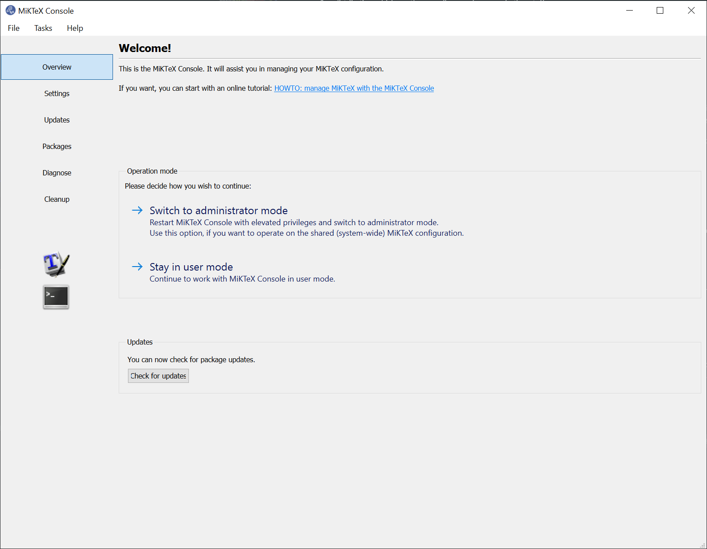
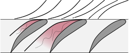
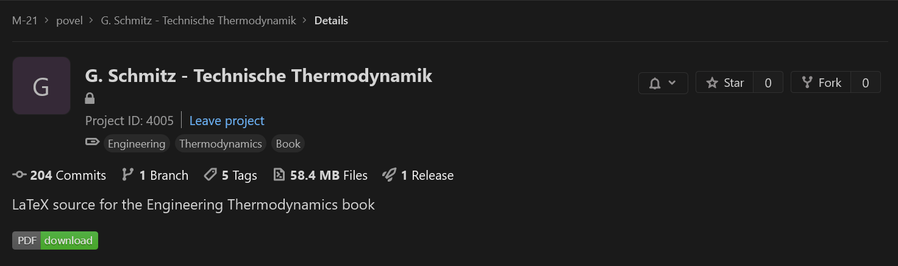
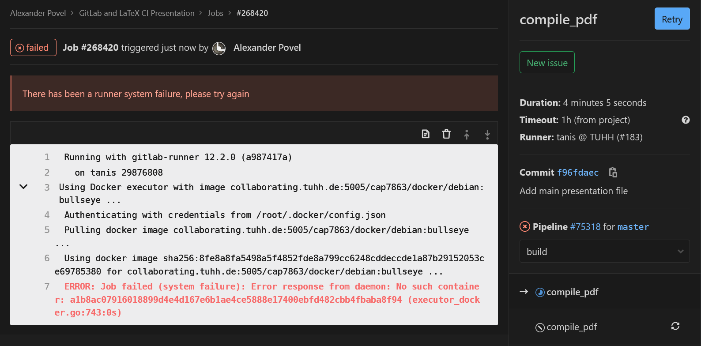

---
title: "LaTeX, GitLab and Continuous Integration"
author: [Alex Povel]
date: "2020-04-02"
subject: "Presenting the advantages and a workflow using LaTeX and GitLab"
keywords: [LaTeX, GitLab, CI, Markdown]
lang: "en"
titlepage: true
toc: true
colorlinks: true
...

# A Cookbook for LaTeX with git

The `beamer` (a LaTeX `documentclass` for presentations) PDF document of this repository
is supposed to explain the *Why*, as in *Why is using Git(Lab) for LaTeX (and other things) useful?*,
while this README is supposed to dig into the *How*, as in *How can you get started with it?*.

Eventually, following all the steps, a number of advantages will come to light:

- [SSOT](https://en.wikipedia.org/wiki/Single_source_of_truth): a *Single Source Of Truth*
  for data.
  No more file trees looking like this:

  ```text
  directory
  │   a.txt
  │   help.me.please
  │   Important-Document_2018_version1.pdf
  │   Important-Document_2018_version2.pdf
  │   Important-Document_2018_version3_final.pdf
  │   Important-Document_2018_version3_final_really.pdf
  │   Important-Document_2018_version3_final_really_I-promise.pdf
  │   Important-Document_2018_versionA.pdf
  │   Important-Document_2019-03-56.pdf
  │   Important-Document_2019-03-56_corrections_John-Doe.pdf
  │   Important-Document_2019-03-56_corrections_John-Doe_v2.pdf
  │   invoice.docx
  │   test - Copy (2).tex
  │   test - Copy.tex
  │   test.tex
  │
  └───old_stuff
          Screenshot 1999-09-03-15-23-15(1).bmp
          Screenshot 1999-09-03-15-23-15(2).bmp
          Screenshot 1999-09-03-15-23-15(3).bmp
          Screenshot 1999-09-03-15-23-15(3)_edited.bmp
          Screenshot 1999-09-03-15-23-15.bmp
  ```

  Instead, there is one *working copy* looking like this:

  ```text
  directory
  │   .git (a hidden directory)
  │   a.txt
  │   Important-Document.pdf
  │   Properly-Named-Invoice.docx
  ```

  assuming that `a.txt` is actually needed.
  **All the old junk and redundant copies have been pruned**.
  However, **nothing was lost**.
  The entire history is contained in [**git**](https://en.wikipedia.org/wiki/Git), a *Version Control System*.
  The history is readily summoned anytime, if so required.
  Git calls this its *log*.
  Git works best (some would say only) on text-based files, but it can deal with images, PDFs *etc.*, too.

  The history and everything else git needs is contained in its `.git` directory, which is hidden on both Linux and Windows.
  Everything else in `directory`, so in this case `a.txt`, `Important-Document.pdf` and `Properly-Named-Invoice.docx`, are accessible as usual.
  **There is no difference to how you would normally work with these files.**
  They are on your local disk.
  Together, they are called the *working tree*.

  Therefore (provided that git is used correctly):

  1. Duplicate files are gone,
  2. The art of creative file naming will finally be forgotten,
  3. Old stuff can be safely deleted; this cleans up the working tree and makes it clear which files are no longer needed.
     Only the currently needed files are visible, the rest is history.
- 

Advantages/Disadvantages

# Basics

The basic tools for you to get you started.

## LaTeX

LaTeX requires three things:

1. of course, a source text file, ending in `.tex`. A minimal example is:

   ```latex
   \documentclass{scrartcl}
   \begin{document}
       Hello World!
   \end{document}
   ```

   Note the usage of `scrartcl` over the standard `article`.
   This is a *KOMAScript* class.
   If you would like to know more, look below.
   Otherwise, just use it everywhere and profit.

2. a *distribution*, which are the compilers, packages and other stuff:

   - *Compilers* translate high-level source code (see the first point) into a different "language".
     In our case, the other language is PDF source code.
     It is not human-readable and mostly gibberish, but a PDF viewer takes care of that.
   - *Packages* are bundles of ready-made functionalities for LaTeX.
     There are packages for basically everything.
     The [Comprehensive TeX Archive Network (CTAN)](https://ctan.org/), a *package repository*,
     contains basically all of them.

   UNIX-based operating systems do well with [**TeXLive**](https://www.tug.org/texlive/),
   which is available as a package for most distributions.
   It is also available for Windows.
   It has a yearly release schedule.
   So there might be [bugs](https://tex.stackexchange.com/a/476742/120853) that don't get fixed
   for a whole year.
   Nevertheless, I can recommend it.

   Another viable alternative is [**MiKTeX**](https://miktex.org/).
   It has a rolling release model, aka updates to packages are published whenever they're deemed ready.
   MiKTeX's GUI (*MiKTeX Console*) is pretty polished and I am using it successfully on Windows:

   

   You should hit **Check for updates** at least yearly, rather biannually.
   LaTeX is a slow world, in which files from the previous millennium might very well still compile.
   However, a very large number of errors are caused by out-of-date packages.
   For example, if your LaTeX distribution is ancient (anything older than, say, 3 years),
   and you then compile a new file that installs a new package, you suddenly have that package
   in its latest version, alongside all the old packages.
   That will not go well long.

3. an *editor*.

   Here, you are free to do whatever you want.
   I recommend [Visual Studio Code](https://code.visualstudio.com/), using its
   [LaTeX Workshop](https://marketplace.visualstudio.com/items?itemName=James-Yu.latex-workshop)
   extension, which provides syntax highlighting, shortcuts and many other useful things.
   VSCode is among the most state-of-the-art editors currently available.
   Being usable for LaTeX is just a nice "side-effect" we can take advantage of.

   For a more conventional, complete IDE (Integrated Development Environment),
   try [TeXStudio](https://www.texstudio.org/).
   Like [VSCode](https://github.com/microsoft/vscode),
   it is also [open source](https://github.com/texstudio-org/texstudio).
   TeXStudio will cater to 99% of your LaTeX needs.

   If you like to live dangerously, you can even write your LaTeX in Notepad.

## git

There is no *GitLab* (or *GitHub* for that matter) without *git*.

## Git(Lab) and Continuous Integration

### Docker

Docker is a tool providing so-called *containers*.
These containers are light-weight virtual machines,
providing isolated environments for applications to run in.
They are created from corresponding *images*.
These images are in turn generated using scripts, so-called *Dockerfiles*.

In summary, we create a `Dockerfile` with instructions on how the image should look like.
The image is then built accordingly, resulting in a large-ish file that contains an
executable virtual machine.
For example, if we install a complete `TeXLive` distribution, the image will be more than
5 Gigabytes in size.
Once the image is created, it can be run, creating the container.
We can then enter the container and use it like a normal (in this case Linux) machine,
for example to compile our `tex` files.

One concrete workflow to employ this chain is to have a Dockerfile repository on GitHub,
[like this one](https://github.com/alexpovel/latex-extras-docker).
GitHub integrates with [DockerHub](https://hub.docker.com/), the official service provided
by Docker themselves.
It allows users to share images.
As such, there is an image called
[alexpovel/latex](https://hub.docker.com/repository/docker/alexpovel/latex)
on Dockerhub.
This *image* was built using the above GitHub *Dockerfile* and can be downloaded and run,
yielding a live *container*.
On every `git push` (that is, on every change) in the GitHub repo, this image is rebuilt.
Given the size of `TeXLive`, this takes about on hour.

The above [example Dockerfile](https://github.com/alexpovel/latex-extras-docker/blob/master/Dockerfile)
(that Dockerfile is used to compile this very README to PDF via `pandoc`, as explained later)
can look like this:

```dockerfile
FROM debian:bullseye

LABEL maintainer="Alex Povel"

ENV DEBIAN_FRONTEND noninteractive

RUN apt-get update -y \
  && apt-get install -y \
    texlive-full \
    default-jre \
    inkscape \
    gnuplot \
    pandoc \
    curl \
    wget \
    librsvg2-bin
```

The steps are as follows:

1. `FROM` pulls a [*base image*](https://hub.docker.com/search/?type=image&category=base),
   in this case a certain version of Debian (`bullseye`, Debian 11).
   This version will still be the same ten years from now,
   allowing for tight control over the build environment.
   Things are compiled in this fixed version, eliminating issues of incompatibilities across
   machines *forever*.
   No longer will you have to seek out that one coworker with that specific installation of
   a software that is the only remaining survivor still capable of compiling this one ancient
   piece of code.
   Alternatively, we can use a *tag* like `latest` and get `debian:latest`.
   That would also work just fine in most cases, and would get us the currently latest version.

2. `LABEL` adds metadata to an image. It is pretty self-explanatory.
   Note that before Docker 1.6, this would have read `MAINTAINER <name>`, which has since
   been deprecated.

3. `ENV` defines an environment variable, because `texlive-full`
   [will usually prompt for *Geographic Area*](https://stackoverflow.com/q/52108289).
   `DEBIAN_FRONTEND=noninteractive` suppresses this dialog creation,
   to which we would be unable to respond in a Docker building process (which is why it then fails).
   This procedure is discouraged from in the
   [FAQ](https://docs.docker.com/engine/faq/#why-is-debian_frontendnoninteractive-discouraged-in-dockerfiles),
   but that shouldn't be relevant here.

4. `RUN` executes the given command to construct the image.
   This can be all sorts of complicated magic, but we only `apt update` the package cache,
   which downloads package information from the respective sources.
   Afterwards, `install` (automatically agree to prompts with 'yes' using `-y`,
   since the build process has to be able to run autonomously) packages.

#### Installed packages

1. `texlive-full` for a truly *full* LaTeX distribution.
   The resulting version of `TeXLive` (*e.g.* `2019`) depends on what is available in the
   package repositories of the operating system.
   For `debian:bullseye`, [we get TeXLive 2019](https://packages.debian.org/bullseye/texlive-full).
   A full distribution includes Arabic, Chinese and many other fonts and supporting packages
   that we are exceedingly unlikely to ever need.
   However, the alternative is to only install the currently needed packages.
   This would mean to only get `texlive-base` and use `tlmgr`,
   the [package manager of TeXLive](https://www.tug.org/texlive/pkginstall.html),
   to install packages on an as-needed basis.
   It is quickly apparent how that gets out of hand fast:
   whenever we want to use a new package, we have to update the entire Docker image.
2. `default-jre` for the `bib2gls` tool from the `glossaries-extra`
   [package](https://www.ctan.org/pkg/glossaries-extra?lang=de).
   `jre` stands for *Java Runtime Environment*, which is exactly what `bib2gls` needs.
   `glossaries-extra` is the currently best and most modern approach to glossaries,
   acronyms, lists of symbols, abbreviations and whatnot for LaTeX.
   `bib2gls` is an external tool that it employs to convert external `*.bib` files with
   definitions for, for example, acronyms, into a TeX-compatible format.
   During conversion, it also processes all the entries, like sorting them in whatever
   way you request.
   A minimal `bib` file for acronyms can be as simple as:

   ```latex
   @abbreviation{cont_int,
      short={CI},
      long={Continuous Integration},
    }
   ```

   See also [here](https://github.com/alexpovel/thesis_template/tree/master/glossaries).
   Effectively, this is analogous to how bibliography entries are created.
   Thus, users of LaTeX are already familiar with the concept and format, and should
   have an easy time getting started with `glossaries-extra`.
   I recommend also using it for mathematical symbols, like for example so:

   ```latex
   @symbol{abs_temperature,
      name={\ensuremath{T}},
      description={absolute temperature},
      group={roman},
      user1={\si{\kelvin}},
   }
   ```

3. `inkscape` because the `svg` package needs it.
   Including SVG files using (`lua`)`latex` is not very straightforward.
   Using the [`svg`](https://ctan.org/pkg/svg?lang=en) package, the workflow is somewhat automated.
   We keep just the original SVG files as the single source of truth, and leave the generation
   of the `pdf` and accompanying `pdf_tex` file to the package.
   It calls InkScape for converting the `svg` to `pdf` (or another format of choice),
   and if the `svg` contains text to be included as LaTeX, a sidecar `pdf_tex` file is
   generated (the default behaviour).
   To call InkScape, it requires elevation, aka `--shell-escape`.
   Once those files are generated, they can be treated as temporary junk and are always easily regenerated.

   After years of experimentation, this seems like the best workflow.
   The only laborious manual task left is placement of annotations onto the generated PDF
   files (generated automatically by [`svg`](https://ctan.org/pkg/svg?lang=en) from the SVG source files).

   This seems like the best deal: no text is left in the SVG files themselves.
   Placing and debugging text in SVG files using the InkScape -> PDF+PDF_TEX route is *very*, *very* annoying.
   This is because while InkScape offers text alignment operations (left, center, right)
   that translate into the embedded PDF_TEX, the font cannot be known a priori while working on the SVG.
   Neither font size (most importantly its height), nor any other font property can be assumed.
   This also makes functions like "Resize page to drawing or selection" futile if text is
   part of the outer elements of a drawing.

   Wanting to change any text later on results in having to start InkScape instead of
   just doing it in the TeX source.
   The alternative is to place macros (`\newcommand*{}`) everywhere inside the original SVG
   where content should later be placed.
   These macros serve as labels, but are ugly, annoying, and remove the usability of the
   plain, original SVG file (since we would first need to know what each macro stands for).

   Using the `svg` package to generate plain, text-less PDFs and only later adding any
   text/annotation in the TeX source itself seems the best of both worlds.
   **It certainly allows both tools to do what they're good at, and no more**:
   draw free-flowing vectors graphics with InkScape, then add text in LaTeX
   (which can be done in `foreach` loops as well).
   An example for this is this `tikzpicture`:

   ```latex
      \begin{tikzpicture}[
          every node/.style={
              font=\footnotesize
          }
      ]
       \node[anchor=south west,inner sep=0] (image) at (0,0) {
       % Specify \svgpath{} (like \graphicspath{} but for the svg package)
       % in the preamble for ease-of-use.
           \includesvg[width=0.8\textwidth]{example_vector}
       };
       \begin{scope}[x={(image.south east)},y={(image.north west)}]
           \node[above, align=center] at (0.07,0.10) {%
               \ctrw{next to}\\\ctrw{stall}\\\ctrw{\textbf{A}}%
           };
           \node[above, align=center] at (0.35,0.10) {%
               \ctrw{stall}\\\ctrw{cell}\\\ctrw{\textbf{B}}%
           };
           \node[above, align=center] at (0.62,0.10) {%
               \ctrw{stabilized}\\\ctrw{\textbf{C}}%
           };

           % All nodes on right side:
           \foreach \x/\y/\ynode/\nodetext in {%
               0.78/0.30/0.20/{Blade},%
               0.95/0.35/0.40/{Rotor}%
           }{%
               \draw[annotationarrow] (\x,\y) -- (1.01,\ynode)
                   node[align=left, right, text width=5em] {\nodetext};
           }

           % DEBUGGING COMMAND
           % \debugtikzsvg
       \end{scope}
   \end{tikzpicture}
   ```

   which requires a preamble like this:

   ```latex
   \usepackage{hyperref}
   \usepackage{siunitx}
   \usepackage{tikz}
       \usetikzlibrary{
           arrows,
           calc,
       }
       \tikzset{
           annotationarrow/.style={%
               % A style intended to point a line with a thick black dot at its end onto
               % elements to give further explanations.
               % Since we shorten the line START, any line using this style should originate
               % from the place where the shortening is supposed to take place.
               % Further explanation here:
               % https://tex.stackexchange.com/a/11879/120853
               % Simply call -* (or any other similar command) after annoationarrow if the
               % direction should be inverted
               *-,
               shorten <=-(1.8pt + 1.4\pgflinewidth),%
           },
       }
       % When placing nodes over included SVGs using Tikz, we require some help to debug the positions:
       \newcommand*{\debugtikzsvg}{
           % This has to be evoked within a \begin{scope}[x={(image.south east)},y={(image.north west)}]
           % The image we invoke the grid "on top of" needs to be labelled "image"
           \draw[help lines,xstep=0.02,ystep=0.02, opacity=0.5] (image.south west) grid (image.north east);
           \draw[gray, thick, xstep=0.1,ystep=0.1, opacity=0.8] (image.south west) grid (image.north east);
           %
           \foreach \posfraction in {
               0, 0.1, ...,1%
           }{
               \foreach \startpoint/\endpoint/\nodeorientation in {
                   south west/south east/below,
                   north west/north east/above,
                   south east/north east/right,
                   south west/north west/left%
               }{
                   \node[\nodeorientation, opacity=0.5]
                       at ($(image.\startpoint)!\posfraction!(image.\endpoint)$) {
                           \pgfmathparse{int(\posfraction*10)}\num{\pgfmathresult}
                       };
               }
           }
       }

   \usepackage{contour}
       \contourlength{0.1em}
       \newcommand*{\ctrw}[1]{% Black text, white contour
           \hypersetup{hidelinks}%
           \contour{white}{\textcolor{black}{#1}}%
       }%

   \usepackage{svg}
       % See also:
       % https://tex.stackexchange.com/a/158612/120853. pdftexcmds package etc. no longer
       % seems necessary; svg package documentation states that it is a dependency,
       % but done automatically. https://tex.stackexchange.com/a/74693/120853

       % Build failed on my system due to lack of the 'canberra' module, see for a fix:
       % https://askubuntu.com/a/872397/978477

       % Running the document to generate the PDF and PDF_TEX file from the original SVG
       %  will require SHELL ESCAPE (--shell-escape).
       % However, after the auxiliary images have been created, they only need to be input;
       % shell-escape will no longer be required.
       \svgpath{images/vectors/}
       \svgsetup{
           inkscapepath=svgsubdir,% Put into subdirectory of where original SVG was found
           % In most cases, we include SVGs that contain no text, then add it in a
           % tikzpicture overlay. Therefore, don't generate *.pdf_tex file:
           inkscapelatex=false,
       }
   ```

   The result can look like:

   

   To place the labels, there is a debug mode using `\debugtikz`:

   

   All this while the base vector graphic file at `images/vectors/example_vector.svg` contains
   no text at all:

   

   This is very conveninent indeed, since we can now do everything in `tikz` and basically
   never have to revisit the base SVG file, unless the *graphic itself* changes.
   All the labels stay in the `tex` source and are therefore also manageable through `git`.
   Lastly, the required PDFs and PDF_TEXs are only generated at build-time on the server,
   and afterwards discarded.
   If you work locally, they will be kept in `images/vectors/svk-inkscape/`, so that they
   don't have to be regenerated every time.
   This is somewhat important since **PDFs are binary and should never occur in a git repository**.
   Git can only accept PDFs as single blobs and cannot diff them properly.
   If git cannot efficiently store only the *changes* between two versions of a file, like it
   can with text-based ones, the repository might absolutely explode in size, since each
   PDF revision will be stored at its full size.
   That is not a proper usage of git.
   It works, but should be avoided.

   Neatly, SVGs are text-based (try it out yourself: open an SVG file in a text editor).
   They are `XML` files, *extensible markup language*.
   So next to *Markdown* and *LaTeX*, a *third* markup language!
   We don't really care for that though, other than that it means that
   *SVGs are source-controllable (to an extent) through git*.
   A nice bonus, further strengthening the argument of *only* using plain SVGs in the repository.
4. `gnuplot` for `contour gnuplot` commands for `addplot3` in `pgfplots`.
   So essentially, an external add-on for the magnificent `pgfplots` package.
   Being an external tool, `gnuplot` also requires `shell-escape`.
5. `pandoc` is a very convenient, universal markup converter.
   For example, it can convert Markdown (like this very [README](README.md)) to PDF via LaTeX:

   ```bash
   pandoc README.md -o README.pdf
   ```

   The default output is usable, but not very pretty.
   This is where *templates* come into play.
   A very tidy and well-made such template is [*Eisvogel*](https://github.com/Wandmalfarbe/pandoc-latex-template).
   Its installation is not via a package, so we have to download the archive and unpack it.
   For this, we additionally require:

   1. `curl` to transfer data from a server,
   2. `wget` to download,
   3. `librsvg2-bin` for the `rsvg-convert` tool.
      This is used by `pandoc` to convert SVGs when embedding them into the new PDF.
      This README itself contains such SVGs, it is therefore required.

   The full chain in `bash` as used in the [GitLab CI config file](.gitlab-ci.yml) is then:

   ```bash
   PANDOC_TEMPLATE_URL=$(\
       curl -s https://api.github.com/repos/Wandmalfarbe/pandoc-latex-template/releases/latest | \
       grep "browser_download_url.*\.tar\.gz" | \
       cut -d \" -f 4
   )
   # Download archive
   wget $PANDOC_TEMPLATE_URL
   # Unpack single file
   tar -xf Eisvogel*.tar.gz eisvogel.tex
   # Change that file's suffix to .latex
   mv eisvogel.tex eisvogel.latex
   # pandoc looks for template with .latex suffix in current dir
   pandoc README.md --template eisvogel --number-sections -o README.pdf
   ```

   Lastly, `pandoc` and its *Eisvogel* template draw
   [metadata from the YAML header](https://pandoc.org/MANUAL.html#metadata-variables).
   In this very README, the Markdown version has metadata in the form:

   ```yaml
   ---
   title: "Title"
   author: [Author]
   date: "YYYY-MM-DD"
   subject: "Subject"
   keywords: [Keyword1, Keyword2]
   lang: "en"
   ...
   ```

   among other metadata variables.
   This info is detected and *not* rendered by many Markdown rendering engines.
   However, GitLab sadly still picks it up.
   So does *Eisvogel*, which uses it to fill the document with info,
   *e.g.* the PDF header and footer.

This concludes the Docker section.
For more Docker images for LaTeX, see:

- [blang/latex-docker](https://github.com/blang/latex-docker)
- [Daxten/java-latex-docker](https://github.com/Daxten/java-latex-docker)
- [aergus/dockerfiles](https://github.com/aergus/dockerfiles)
- [Building a LaTeX Docker image](https://gordonlesti.com/building-a-latex-docker-image/)

### Enable CI Runner for the project

To build anything, we need someone to build for us.
GitLab calls these build-servers *runners*.
Such a runner does not materialize out of thin air.
Luckily, in the case of *collaborating.tuhh.de*, runner *tanis* is available to us.
Enable it (him? her?) for the project on the [GitLab project page](.):
`Settings -> CI/CD -> Runners -> Enable Shared Runners`.
Otherwise, the build process might get 'stuck'.

### Add git info to PDF metadata

After retrieving a built PDF, it might get lost in the nether.
That is, the downloader loses track of what commit it belongs to, or even what release.
This is circumvented by injecting the git SHA into the PDF metadata.
In git, every object is uniquely identified by its hash (SHA):

```text
412ba291b6980ab21f912b5cdf01a13c6268d0ed
```

It is convenient to abbreviate the full SHA to a short version:

```text
412ba291
```

Since a collision of even short hashes is impossible for our modest uses,
we can uniquely identify states of the project by this short SHA.
This is why commands like `git show 412ba291` work (try it out; the SHA exists in this repository!).
(As a side note: GitLab picks up on those hashes automatically, as shown in
[commit `ccedcda0`](https://collaborating.tuhh.de/cap7863/gitlab-and-latex-ci-presentation/-/commit/ccedcda05d0dd1bb200126aebdaf241d4ecb695d).)
So if we have this SHA available in the PDF, never again will there be confusion about versions.
The PDF will be be assignable to an exact commit.
It can look like this (in Adobe Reader, evoke file properties with `CTRL + D`):


But how do we get it there?

We have a chicken-and-egg problem:
if we want to insert the *current* SHA into the *current* PDF, we can't.
While building the *current* PDF, we can only know the SHA of the *previous* commit.
**But**, fear not, for GitLab has you covered:

During build-time, GitLab provides [*environment variables*](https://docs.gitlab.com/ee/ci/variables/).
These include things like `CI_COMMIT_SHORT_SHA`, which is exactly what we want.
Now, we only need to get the contents of that variable into the LaTeX source,
and finally the compiled PDF.

The LaTeX package `hyperref` can modify PDF metadata.
In the LaTeX preamble, we can then use

```latex
\usepackage[pdfusetitle]{hyperref}% pdfusetitle reads from \author and \title
    \hypersetup{%
        pdfsubject={Buch zur Vorlesung},%
        pdfcreator={LaTeX with hyperref (\GitVersion{}, \GitShortHash{})},
    }
```

to get metadata like in the PDF above.
Note that in LaTeX, you likely used `\author{<author's name>}` and `\title{<document title>}`
somewhere in the preamble to generate a title page.
`hyperref`'s `pdfusetitle` option will use those values for the PDF metadata.
`pdfsubject` is self-explanatory.
Lastly, `pdfcreator` will fill the `Application` field we see above.
However, `\GitVersion{}` and `\GitShortHash{}}` need to be filled.
These are defined earlier in the preamble:

```latex
\newcommand*{\GitVersion}{n.a.}
\newcommand*{\GitShortHash}{n.a.}
```

(Side note: use the [starred variant of `newcommand`](https://tex.stackexchange.com/a/1057/120853),
unless you need paragraph breaks, which is mostly not the case).

Using the above definition, the fields will just show up as *not available* if for example
compiling locally ("at home").
The server has a script employing `sed` (since we're using GNU/Linux there),
specified in [.gitlab-ci.yml](.gitlab-ci.yml), that seeks `GitVersion` and `GitShortHash`
and replaces whatever comes in the curly braces of those commands:

```bash
# Use `- |` for multi-line commands.

# Declare associative (-A) array with predefined GitLab CI variables.
# The keys correspond to the command names found in the LaTeX code:
- |
    declare -A GITINFO=(
        [GitVersion]=$CI_COMMIT_REF_NAME
        [GitShortHash]=$CI_COMMIT_SHORT_SHA
    )

# Iterate over array and replace the LaTeX commands,
# e.g. \newcommand*{\GitVersion}{n.a.},
# with
# e.g. \newcommand*{\GitVersion}{v1.00}.
# Use double quotes to enable variable expansion.
# Employ and use capture group (\1) to replace current LaTeX command
# (given by key in array) by corresponding value for that key.
- |
    for k in "${!GITINFO[@]}"
        do
            sed -i "s!\($k}{\).*}!\1${GITINFO[$k]}}!g" <filename>.tex
        done
```

### Add 'PDF Download' Button

On the top of the project page, we can add *badges*.
That's how GitLab calls the small, clickable buttons.
For *real* programmers, these might display code coverage and similar things.
For, well... *us*, they can be used as a convenient way to download the built PDF.
It can look like this (bottom left):



A little image (`svg` format) can be generated using [shields.io](https://shields.io/).
That only needs to be done once, and if you want to reuse the existing one, here it is:


Its URL is `https://img.shields.io/badge/PDF-download-success`.
To add it to the project, go to:
`Settings -> General -> Badges`.
Give it a `Name`, enter the above URL for the `Badge image URL` (or do whatever you want here),
and finally enter the `Link`.
This part is a bit tricky, since we need a dynamic URL that adapts to our path.
For this, GitLab provides variables like `%{project_path}`.
As such, the URL is (the hyphen in the middle is intentional):

```bash
https://collaborating.tuhh.de/%{project_path}/-/jobs/artifacts/%{default_branch}/raw/<filename>.pdf?job=compile_pdf
```

The `project_path` is clear, the `default_branch` is just `master`.
It visits the job artifacts on `master` and gets the `PDF` with the supplied filename.
**This filename has to be adjusted accordingly**.

Note that the download is **unavailable** while a job is running.
To avoid this, work on a git branch and leave `master` alone.
Treat the PDF (or whatever it is) on `master` as the current stable version that only changes sometimes,
not with every commit.
For example, you can do your continuous business on a `dev` branch and then add a second button,

```bash
https://collaborating.tuhh.de/%{project_path}/-/jobs/artifacts/dev/raw/<filename>.pdf?job=compile_pdf
```

# Possible issues and pitfalls

Many nights were lost over issues involving GitLab CI, but also plain LaTeX.
Here is a non-exhaustive list --- a bit like a gallery of failure --- of the most common ones.
Hopefully, it spares you some despair.

- The job is working on `Pulling docker image` [`link to docker image`](.gitlab-ci.yml#L2)
  for a while, and finally fails with

  ```bash
  ERROR: Job failed (system failure): Error response from daemon: No such container <some long container ID>
  ```

  Since, after we ensured the [image](.gitlab-ci.yml#L2) indeed exists, know that cannot be the case,
  we *Retry* the job from the job page's top right corner:

  

  It should work afterwards (it never failed to restart after retrying for me).
  This will happen once in a while for some reason, perhaps caching.
  This has been an [active issue](https://gitlab.com/gitlab-org/gitlab-runner/-/issues/4450)
  for over two years now, with (at time of writing) the most recent comment within the last
  24 hours.
  So, it is still in active discussion.
  It seems to have to do with caching.
  There does not seem to be a solution yet.
- When using package [`fontspec`](https://ctan.org/pkg/fontspec)
  (or its derivative [`unicode-math`](https://ctan.org/pkg/unicode-math)),
  compilation fails with

  ```text
  ! error:  (type 2): cannot find file ''
  !  ==> Fatal error occurred, no output PDF file produced!
  ```

  It is possible that the font cache is corrupted after moving fonts around.
  For example, if previously all fonts were in a flat `./fonts/` subdirectory of your
  document root, and then you decide to sort them into `./fonts/sans/` etc., the luatex
  cache will still point to the old ones.

  See [here](https://tex.stackexchange.com/a/311455/120853)
  and also, similarly, [here](https://tex.stackexchange.com/a/453878/120853)
  for a solution:
  delete the `.lua` and `.luc` files of the fonts in question from `luatex-cache/generic/fonts/`.
  For MiKTeX 2.9 on Windows 10, this was found in
  `%USERPROFILE%\AppData\Local\MiKTeX\2.9\luatex-cache`.
- When using package [`pgf-spectra`](https://ctan.org/pkg/pgf-spectra?lang=en)
  compilation fails with

  ```text
  LaTeX Error: File 'spectra.data.tex' not found.
  ```

  For a solution, see
  [here](https://tug.org/pipermail/tex-live/2017-January/039591.html), where it says:

  > Hi
  >
  > texlive/2016/texmf-dist/tex/latex/pgf-spectra/pgf-spectra.sty
  >
  > ends with
  >
  > \input{spectra.data.tex}
  >
  > which generates a missing file error if the package is used, the data file
  > is on ctan but it's misplaced in texlive as
  >
  > texlive/2016/texmf-dist/doc/latex/pgf-spectra/spectra.data.tex
  >
  > It should be in the tex tree not doc,
  >
  > David

  So, get
  [`spectra.data.tex` from CTAN](http://mirrors.ctan.org/graphics/pgf/contrib/pgf-spectra/spectra.data.tex)
  and place it accordingly.
  This can mean placing it in the project root.
  It would be better to put it next to the package file itself, `pgf-spectra.sty`, but this did not
  work even after refreshing the package database.
  This occurred on MiKTeX 2.9.
  TeXLive seemed fine in version 2019.

# Appendix

## Hints for source files

These are valid not only for LaTeX files, but most text-based source files:

- **For the love of God**, use `UTF-8` or higher for text encoding.
  Stop using `Windows 1252`, `Latin` etc.
  Existing files can be easily updated to UTF-8 without much danger for regression
  (*i.e.*, introducing errors).
- Put each sentence, or even part of a sentence, and each instruction onto its own line.
  This is very important to `diff` files properly, aka `git diff`.
  Generally, [keep lines short](https://tex.stackexchange.com/q/325505/120853).
- In a similar vein, use indentation appropriately. Indent using **4 spaces**.
  There are schools of thought that advocate two spaces, or also one tab.
  Ultimately, that does not really matter.
  'Four spaces' just seems to generally win the fight for a common coding style,
  bringing us to the next point.
- **Be consistent**. Even if you pull your own custom stuff, at least be consistent in doing so.
  This makes things predictable, the code will be easier to read, and also more easily
  changed programmatically.
  GUN/Linux and by extension Windows using
  [Windows Subsystem for Linux](https://en.wikipedia.org/wiki/Windows_Subsystem_for_Linux)
  has a very wide range of tools that make search, and search-and-replace, and various other
  operations for plain text files easy.
  However, if the text is scattered and the style was mangled and fragmented into various
  sub-styles, this becomes very hard.
  For example, one person might use `$<math>$` for inline-LaTeX math, another the
  ([preferred](https://tex.stackexchange.com/q/510/120853)) `\(<math>\)` style.
  Suddenly, you would have to search for both versions to find all inline-math.
  So stay consistent. If you work on pre-existing documents, use the established style.
  If you change it, change it fully, and not just for newly added work.

### LaTeX-specific hints

- For the love of all that is holy, use [KOMA-Script](https://ctan.org/pkg/koma-script?lang=en).
  There are only [two reasons](https://tex.stackexchange.com/a/73146/120853) why you would not,
  both of which usually don't apply.
  KOMAScript replaces the conventional `documentclass`es like so:
  - `article` becomes `scrartcl`
  - `report` becomes `scrreprt`
  - `book` becomes `scrbook`
  - there is also a `letter` class, that will make writing letters very easy.

  KOMAScript will provide you with a very large host of tools and settings that work very
  well indeed.
  Those combine most options you would otherwise get from other packages into one convenient class.
  Included are, among others:

  - `scrlayer-scrpage` instead of `fancyhdr` for page style, header and footers etc.
  - `tocbasic` to modify the Table of Contents and other lists
  - `scrlttr2` for typesetting letters

  The defaults of `KOMAScript` are also great (like using `a4paper` over `legal`),
  so you can also get started without dealing with options or packages at all.
- If you encounter either of the following:

  ```latex
  \usepackage{fontenc}
  \usepackage{inputenc}
  ```

  then the file at hand is **outdated**.
  Possibly not terribly so, but these two packages should at least not be used for *new* work.
  They are [not required anymore](https://tex.stackexchange.com/q/412757/120853) in 2020,
  using lualatex.
- **Do not roll your own solutions --- use existing packages**.
  The likelihood that there already exists a package for whatever problem you have at hand is quite high.
  It ranges from the obvious, like [`biblatex` with `biber`](https://ctan.org/pkg/biblatex)
  for a bibliography and [`siunitx`](https://ctan.org/pkg/siunitx) for physical units,
  to the obscure, like packages for [Gregorian chant](https://ctan.org/pkg/gregoriotex)
  or [drawing ducks](https://www.ctan.org/pkg/tikzducks).

  A non-exhaustive list of problems that often occur but have excellent, existing solutions:

  - **Modifying headers and footers, the Table of Contents (and other lists), chapter numbering and *much* more**:
    [`KOMAScript` document classes and packages](https://ctan.org/pkg/koma-script).
    This point is in bold since it is a biggie: a `documentclass` specification is mandatory in LaTeX.
    By using it, you can do all of these things and more.
    See also the first LaTeX-specific hint.

    Especially for modifying the ToC and headers/footers, there are dozens of ugly, hacky
    ways to achieve that.
    `KOMAScript` does it frictionless.
  - **referencing Figures, Tables and *whatever you want***: [`cleveref`](https://www.ctan.org/pkg/cleveref).
    Also a biggie: it occurs in essentially all LaTeX documents
    longer than a couple pages (which is one of the things LaTeX excels at after all).
    `cleveref` allows you to simply write `\cref{<your label>}` and it will print the
    correct type of what is being referenced (in your chosen language), followed by the
    correct number, like *Figure 3.4*.
    Plurals are also possible, like `\cref{label1,label2}`, that is a comma-separated list.
    It will automatically print something like *Figures 3.4 to 3.8*.
    Notice the correct plural.

    For the labels, I recommend a schema similar to `fig:description_of_figure`,
    `tab:description_of_table`, `eq:description_of_equation` and so forth.
    This way, you will know from the label name what type you are dealing with.
    Also works well with autocomplete.

    Lastly, you can also define own labels/references for your custom numbered things.
  - drawing (text) boxes, or highlighting equations with boxes:
    [`tcolorbox`](https://www.ctan.org/pkg/tcolorbox) with its
    [`\tcbhighmath` macro](https://tex.stackexchange.com/a/122952/120853).
  - drawing plots: [`pgfplots`](https://ctan.org/pkg/pgfplots), which is based on Ti*k*Z.
    Ti*k*Z is a general-purpose drawing framework for LaTeX.
    As of writing this, the `pgfplots` manual has 571 pages, while `tikz` sits at 1318 (!).
    Almost anything you would ever want to plot or draw is achievable with these two.
  - creating a glossary: [`glossaries-extra`](https://www.ctan.org/pkg/glossaries-extra).
  - creating a bibliography: [`biblatex`](https://ctan.org/pkg/biblatex).
  - typesetting physical units: [`siunitx`](https://ctan.org/pkg/siunitx).
  - always use [`microtype`](https://www.ctan.org/pkg/microtype) for fine-grained, professional-grade
    typesetting improvements. I say *always* because I have yet to see it *not* work and *not*
    improve (on a detailed level) the output document.
    Just slap it into the preamble and call it a day.

  Notice how all of these packages received updates within the last one to two years.
  Having the latest and greatest is not super important in LaTeX,
  since there is nothing security-related etc. to worry about.
  But be mindful of old packages and avoid them as much as possible.
  For example, old packages (think before 2010) are based on `pdflatex` and might not work
  with `lualatex`.
  This is not a reason to forfeit `lualatex` or even its fault!

## Further reading

There is a state-of-the-art (2019) LaTeX thesis template over [at GitHub](https://github.com/alexpovel/thesis_template).
It has a long-ish README, explaining the rationale behind some LaTeX decisions.
The template can serve as an inspiration for how modern LaTeX can look like.
That LaTeX template and the Docker image were the basis for two books and a Master thesis.
