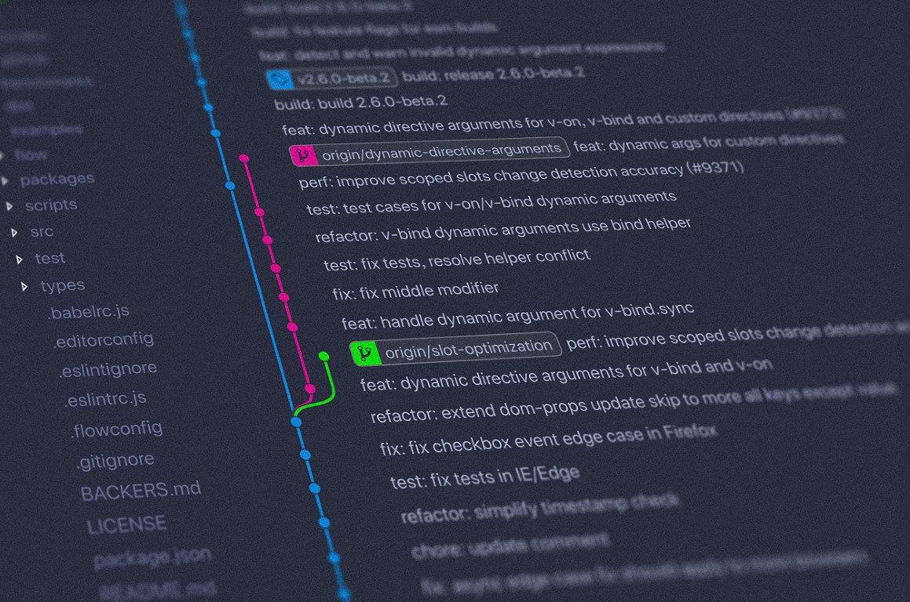
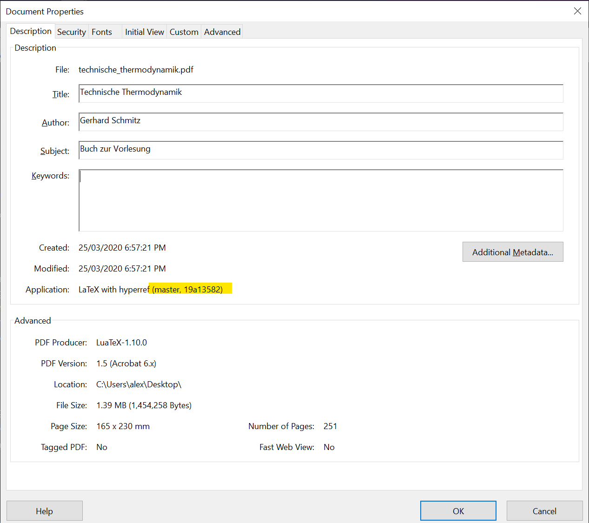
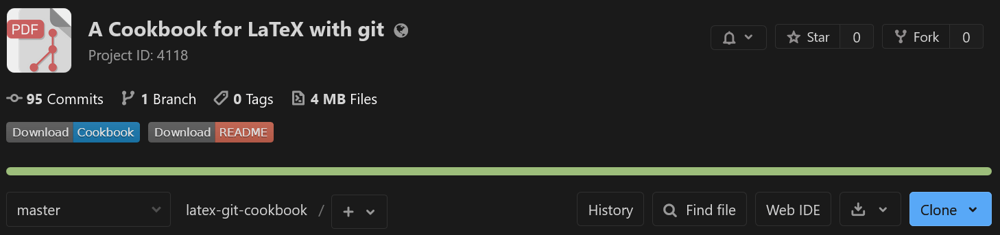

---
title: "LaTeX, GitLab and Continuous Delivery"
author: [Alex Povel]
date: "2020"
subject: "Presenting the advantages and a workflow using LaTeX and GitLab"
keywords: [LaTeX, GitLab, CI, CD, Markdown]
lang: "en"
titlepage: true
toc: true
colorlinks: true
...

# A LaTeX Cookbook, git and Continuous Delivery

> [Remember, a few hours of trial and error can save you several minutes of looking at the README.](https://twitter.com/iamdevloper/status/1060067235316809729)

This [repository](https://collaborating.tuhh.de/alex/latex-git-cookbook)
contains two documents:

1. This README in Markdown format.
   Using `pandoc` with the *Eisvogel* template (more on that later), it is converted
   into a PDF and made available for download (see also the
   [badge](https://docs.gitlab.com/ee/user/project/badges.html) on top of the
   [project homepage](https://collaborating.tuhh.de/alex/latex-git-cookbook)):

   [](https://collaborating.tuhh.de/alex/latex-git-cookbook/-/jobs/artifacts/master/raw/README.pdf?job=compile_pandoc)

   **The README covers git and Continuous Delivery, using Docker.**
2. A [LaTeX document](cookbook.tex), usable as a cookbook (different "recipes" to
   achieve various things in LaTeX) and also as a template.

   The LaTeX Cookbook PDF covers LaTeX-specific topics.
   It is also available for download:

   [](https://collaborating.tuhh.de/alex/latex-git-cookbook/-/jobs/artifacts/master/raw/cookbook.pdf?job=compile_latex)

## git

That being said, onto [git](https://thenewstack.io/tutorial-git-for-absolutely-everyone/).
This README will not be exhaustive; there are numerous great tools to learn git out
there.
This is just a brief introduction.
Eventually, following all the steps, a number of advantages will come to light:

- [SSOT](https://en.wikipedia.org/wiki/Single_source_of_truth): a *Single Source Of Truth*
  for data.
  No more file trees looking like this:

  ```text
  directory
  │   a.txt
  │   help.me.please
  │   Important-Document_2018_version1.pdf
  │   Important-Document_2018_version2.pdf
  │   Important-Document_2018_version3_final.pdf
  │   Important-Document_2018_version3_final_really.pdf
  │   Important-Document_2018_version3_final_really_I-promise.pdf
  │   Important-Document_2018_versionA.pdf
  │   Important-Document_2019-03-56.pdf
  │   Important-Document_2019-03-56_corrections_John-Doe.pdf
  │   Important-Document_2019-03-56_corrections_John-Doe_v2.pdf
  │   invoice.docx
  │   test - Copy (2).tex
  │   test - Copy.tex
  │   test.tex
  │
  └───old_stuff
          Screenshot 1999-09-03-15-23-15(1).bmp
          Screenshot 1999-09-03-15-23-15(2).bmp
          Screenshot 1999-09-03-15-23-15(3).bmp
          Screenshot 1999-09-03-15-23-15(3)_edited.bmp
          Screenshot 1999-09-03-15-23-15.bmp
  ```

  Instead, there is one *working copy* looking like this:

  ```text
  directory
  │   .git (a hidden directory)
  │   a.txt
  │   Important-Document.pdf
  │   Properly-Named-Invoice.docx
  ```

  assuming that `a.txt` is actually needed.
  **All the old junk and redundant copies have been pruned**.
  However, **nothing was lost**.
  The entire history is contained in [**git**](https://en.wikipedia.org/wiki/Git), a *Version Control System*.
  The history is readily summoned anytime, if so required.
  Git calls this its *log*.
  Git works best (some would say only) on text-based files, but it can deal with images, PDFs *etc.*, too.

  The history and everything else git needs is contained in its `.git` directory, which is hidden on both Linux and Windows.
  Everything else in `directory`, so in this case `a.txt`, `Important-Document.pdf` and `Properly-Named-Invoice.docx`, is accessible as usual.
  **There is no difference to how you would normally work with these files.**
  They are on your local disk.
  Together, they are called the *working tree*.

  Therefore (provided that git is used correctly):

  1. Duplicate files are gone,
  2. The art of cumbersome file naming will finally be forgotten,
  3. Old stuff can be safely deleted; this cleans up the working tree and makes it clear which files are no longer needed.
     Only the currently needed files are visible, the rest is (retrievable!) history.
- File versioning and the ability to exactly match outputs (PDFs) to the source code
  that generated them.
- Accelerated bug fixing through `git bisect`, a binary search algorithm that helps
  pinpoint commits (stages of development) that introduced regressions.
- Collaboration: each contributor has a version of the source on their local machine.
  Adjustments are made there, and sent to a central, online repository if they are
  considered ready to be published.
  Git can also be used in a distributed fashion (its original strong suit), but we
  assume a remote repository on GitLab (which is very much similar to GitHub).
  Developers can then also fetch the latest changes from the remote and incorporate
  them into their local copy.

  Do not confuse GitHub, GitLab and others with the tool itself, git.
  Microsoft's GitHub is not synonymous to git.
  A crude, mostly wrong analogy would be: OneDrive is the platform you do collaboration,
  version control and sharing on.
  This is like GitHub (GitLab, ...).
  Office programs like Microsoft Word are used to create original content.
  This is like source code, as created in some editor of your choice.
  Word's built-in revision history, in conjunction with the *process* of naming files,
  for example `2020-05-13_Invoice_John-Doe-Comments_Final.docx`
  ([ISO-8601](https://en.wikipedia.org/wiki/ISO_8601) oh yeah baby),
  would be git.
  It "only" does the version control, but is not a *platform* for source code.
- The remote repository also serves as a back-up solution.
  So do all the distributed local copies.
  At all points, there will be a workable copy *somewhere*.
  In general, git makes losing data extremely hard.
  **If**, or rather *when*, you *do* get into a fight with git about merging, pulling,
  rebasing, conflicts and the like, think of it as git protecting you and your work.
  Often, the reason for git "misbehaving" and making a scene is because it flat-out
  refuses to conduct an operation that would destroy unsaved changes.
  In the long run, this behavior is the desired one, as opposed to losing unsaved
  (in the git-lingo: uncommitted) data.

### Getting Started

Download for [Windows here](https://git-scm.com/download/win).
Install it and spam *Next* without reading the installation and warning prompts,
as you always do.

For Linux, `apt update && apt install git` or whatever.
You likely have it available already.

Then, somewhere on your machine:

```bash
# Create empty directory
$ mkdir test
# Go there
$ cd test
# Set up your git credentials; this will show as the 'Author' of your work
$ git config --global user.name "Foo Bar"
$ git config --global user.email "foo@bar.com"
# Initialize an empty git repository
$ git init
Initialized empty Git repository in ...
# Create some dummy file
$ echo "Hello World!" > test.txt
$ git status
On branch master

No commits yet

Untracked files:
  (use "git add <file>..." to include in what will be committed)
        test.txt

nothing added to commit but untracked files present (use "git add" to track)
# Do as we are told, like good boys:
$ git add .
# There is now a change! The file is ready to be committed, aka "saved" into
# the history.
$ git status
On branch master

No commits yet

Changes to be committed:
  (use "git rm --cached <file>..." to unstage)
        new file:   test.txt
$ git commit -m "Initial file!"
[master (root-commit) 3aaded0] Initial file!
 1 file changed, 0 insertions(+), 0 deletions(-)
 create mode 100644 test.txt
# Have a look at the history up to here:
$ git log --patch
commit 3aaded0365524e9c0cf7c3bc3cb72e1e993def74 (HEAD -> master)
Author: Foo Bar <foo@bar.com>
Date:   Mon Sep 28 15:29:25 2020 +0200

    Initial file!

diff --git a/test.txt b/test.txt
new file mode 100644
index 0000000..de39eb0
Binary files /dev/null and b/test.txt differ
```

And that is the gist of it.
Next, you would want to create a project on GitLab or similar and connect that to
your local repository.
You can then sync changes between the two, enabling collaboration (or a bunch of other
advantages if you keep to yourself).

There are numerous **git GUIs** available.
They are great at visualizing the commit history (which can get convoluted, if
you're doing it wrong), but also offer all the regular CLI functionality in GUI form.
I have nothing to recommend here and am going to distract from this fact using this
pretty git GUI image from [here](https://unsplash.com/photos/842ofHC6MaI):



## Git(Lab) and Continuous Delivery

GitLab is a platform to host git repositories.
Projects on there can serve as git remotes.
As mentioned, in this sense, it is like Microsoft's GitHub, the first large website
to offer such a service (still by far the largest today).
We use GitLab here because <https://collaborating.tuhh.de/> is an *instance* of
GitLab and therefore freely available to university members.

GitLab offers various features for each project.
This includes a Wiki, an issue tracker and pull request management.
Pull requests (PRs for short; GitLab calls these *Merge Requests*) are requests from
outside collaborators who have *forked* and subsequently worked on a project.
Forking projects refers to creating a full copy of the project in the own user space of
collaborators.
As such, they can then work on it, or do whatever else they want.
If for example they add a feature, their own copy is now ahead of the original by
that feature.
To incorporate the changes back to the original, the original repository's maintainers
can be *requested* to *pull* in the changes.
This way, anyone can collaborate and help, without ever interfering with the main
development in the original.

**Continuous Delivery** refers to continuously shipping out the finished "product".
In this case, these are the compiled PDFs.
This is done with the help of so-called *Docker containers*.
The advantages are:

- collaborators no longer rely on their local tool chain, but on a unified, common,
  agreed-upon one.
  It is (usually) guaranteed to work and leads to the same, reproducible, predictable
  results for everyone.

  Docker (also usable locally, not only on the GitLab platform) helps reproduce results:
  - across space: results from coworkers in your office or from half-way across the globe.

     You no longer rely on some obscure, specific machine that happens to be the only
     one on which compilation (PDF production) works.
  - across time: if fixed versions are specified, Docker images allow programs, processes
    pipelines etc. from many years ago to run.
- If LaTeX documents become very long, full compilation runs can take dozens of minutes.
  This is outsourced and silently done on the remote servers, if Continuous Delivery
  is used.
  As such, for example, every `git push` to the servers triggers a
  [*pipeline*](https://collaborating.tuhh.de/alex/latex-git-cookbook/-/pipelines)
  which compiles the PDF and offers it for download afterwards.
  The last part could be called *Continuous Deployment*, albeit a very basic version.

### Docker

Docker is a tool providing so-called *containers* (though wrong, think of them as
light-weight virtual machines).
These containers provide isolated, well-defined environments for applications to run in.
They are created from *running* corresponding Docker *images*.
These images are in turn generated using scripts, so-called *Dockerfiles*.

In summary:

1. a **`Dockerfile` text document** is created, containing instructions on how the image should
   look like (like what stuff to install, what to copy where, ...).

   As a baseline, these instructions often rely on a Debian distribution.
   As such, all the usual Debian/Linux tools can be accessed, like `bash`.

   An (unrelated) [example Dockerfile](https://github.com/alexpovel/random_python/blob/master/music-converter/Dockerfile)
   can look like:

   ```dockerfile
   # Dockerfile

   # Get the latest Debian Slim with Python installed
   FROM python:slim

   # Update the Debian package repositories and install a Debian package.
   # Agree to installation automatically (`-y`)!
   # This is required because Dockerfiles need to run without user interaction.
   RUN apt-get update && apt-get install -y ffmpeg

   # Copy a file from the building host into the image
   COPY requirements.txt .

   # Run some shell command, as you would in a normal sh/bash environment.
   # This is a Python-specific command to install Python packages according to some
   # requirements.
   RUN pip install -r requirements.txt

   # Copy more stuff!
   COPY music-converter/ music-converter/

   # This will be the command the image executes if run.
   # It runs this command as a process and terminates as soon as the process ends
   # (successfully or otherwise).
   # Docker is not like a virtual machine: it is intended to run *one* process, then
   # die. If you need to run it again, just create a new container (instance of a
   # Docker image). Treat containers as *cattle*, not as a *pet*. The
   # container-recreation process is light-weight, fast and the way to go.
   #
   # Of course, this does not stop anyone from running one *long-running* process
   # (as in infinity, `while True`-style). This is still a good use-case for Docker
   # (as are most things!). An example for this is a webserver.
   ENTRYPOINT [ "python", "-m", "music-converter", "/in", "--destination", "/out" ]
   ```

   The Dockerfile this project uses for LaTeX stuff is
   [here](https://github.com/alexpovel/latex-extras-docker/blob/master/Dockerfile).
   It is not as simple, so not as suited for an example.

2. The **image** is then built accordingly, resulting in a large-ish file that contains an
   executable environment.
   For example, if we install a comprehensive `TeXLive` distribution, the image will be
   more than 2 GB in size.

   This Docker image can be distributed.
   In fact, there is [Docker Hub](https://hub.docker.com/), which exists for just this
   purpose.
   If you just instruct to run an image called e.g. `alexpovel/latex`, without
   specifying a full URL to somewhere, Docker will look on the Hub for an image of that
   name (and find it [here](https://hub.docker.com/r/alexpovel/latex)).
   All participants of a project will pull their image from their, and everyone will
   be on the same page (alternatively, you can build the image from the Dockerfile).

   For example, the LaTeX environment for this project requires a whole bunch of
   setting-up.
   This can take hours to read up upon, understand, explain, implement and getting to
   run.
   In some cases, it will be **impossible** if some required part of a project conflicts
   with a pre-existing thing on your computer.
   For example, project *A* requires `perl` in version `6.9.0`, but project *B* requires
   version `4.2.0`.
   This is what Docker is all about: **isolation**.
   Whatever is present on your system does not matter, only the Docker image/container
   contents are relevant.

   If project member *X* has version `6.6.6` and they proclaim
   ["*works for me*"](https://web.archive.org/web/20200928142058/https://events.ccc.de/2016/11/22/hello-this-is-33c3-works-for-me/),
   but you have `1.3.37` and it *doesn't*, and you both cannot change your versions for
   some other reason... tough luck.
   This is what Docker is for.

   Further, if you for example specify `FROM python:3.8.6` as your *base image*, aka
   provided a so-called *tag* of `3.8.6`, it will be that tag in ten years' time still.
   As such, you nailed the version your process takes place in and requires.
   Once set up, this will run on virtually any computer running Docker, be it your
   laptop now or whatever your machine is in ten years.
   This is especially important for the reproducibility of research.
3. Once the image is created, it can be run, **creating a container**.
   We can then enter the container and use it like a pretty normal (usually Linux)
   machine, for example to compile our `tex` files.
   Other, single commands can also be executed.
   For example, to compile `cookbook.tex` in PowerShell when the `alexpovel/latex` image
   is available after [installing Docker](https://docs.docker.com/docker-for-windows/install/)
   and getting the image (`docker pull alexpovel/latex`), run:

   ```powershell
   docker run --rm --volume ${PWD}:/docs --workdir /docs alexpovel/latex latexmk
   ```

   Done!

   In the above command, `--rm` removes the container once its process finishes;
   `--volume` gives access to your current working directory (`${PWD}`) as `/docs`
   **inside** the container.
   Any process can then see the contents of your `$PWD` in `/docs` and work on them.
   Lastly, `--workdir` sets the directory in which to, well, work in.
   The image is `alexpovel/latex` and the command to execute is `latexmk`.

   The latter is a recipe-like tool that automates LaTeX document compilation by running
   `lualatex`, `biber` and whatever else required for compilation as many times as
   needed for proper PDF output (so references like `??` in the PDF are resolved).
   It does this by detecting that auxiliary files no longer change (steady-state).
   The tool is configured using a [config file](.latexmkrc), which is tailor-made for
   this template.

   **For this to work, you do not have to have anything installed on your machine, only Docker**.

One concrete workflow to employ this chain is to have a Dockerfile repository on GitHub,
[like this one](https://github.com/alexpovel/latex-extras-docker).
GitHub then integrates with [DockerHub](https://hub.docker.com/).
It allows users to share images.
As such, there is an image called
[alexpovel/latex](https://hub.docker.com/repository/docker/alexpovel/latex)
on DockerHub.
This *image* was built using the above GitHub *Dockerfile* and can be downloaded and run,
yielding a live *container*.
On every `git push` (that is, on every change) in the GitHub repo, this image is rebuilt.
Given the size of `TeXLive`, this takes about on hour.

Refer to the
[Dockerfile itself](https://github.com/alexpovel/latex-extras-docker/blob/master/Dockerfile)
(that Dockerfile is used to compile this very README to PDF via `pandoc`)
for more details.

#### Installed packages

For more information on the LaTeX packages mentioned
[in the Dockerfile repository](https://github.com/alexpovel/latex-extras-docker),
refer to the accompanying LaTeX cookbook.

#### Equivalent Windows Install

To get the same, or at least a very similar environment running on Windows,
the elements can be installed individually:

1. [MiKTeX](https://miktex.org/download); for a closer match to the Docker, install
   [TeXLive](https://www.tug.org/texlive/windows.html) instead:
   for a LaTeX distribution with the `lualatex`, `biber`, `bib2gls`, `latexmk` etc.
   programs, as well as all LaTeX packages.
2. [Java Runtime Environment](https://www.java.com/en/download/):
   for [`bib2gls`](https://ctan.org/pkg/bib2gls), which is in turn used by
   [`glossaries-extra`](https://ctan.org/pkg/glossaries-extra).
3. [InkScape](https://inkscape.org/release):
   for the [`svg`](https://ctan.org/pkg/svg) package to convert SVGs automatically
   (absolutely none of the `PDF/PDF_TEX` nonsense anymore!)
4. [gnuplot](https://sourceforge.net/projects/gnuplot/files/latest/download):
   for [`pgfplots`](https://ctan.org/pkg/pgfplots) to generate contour plots.
5. [Perl](http://strawberryperl.com/):
   for [`latexmk`](https://mg.readthedocs.io/latexmk.html) to work

(see how annoying, manual and laborious this list is? ... use [Docker](#docker)!)

These are required to compile the LaTeX document.
If InkScape and gnuplot ask to put their respective binaries into the `$PATH`
environment variable, hit yes.
If they do not, add the path yourself to the directory containing the binaries
(`.exe`) in `Edit environment variables for your account -> Path -> Edit... -> New`.

### Enable Runner for the project

To build anything, we need someone to build *for* us.
GitLab calls these build-servers *runners*.
Such a runner does not materialize out of thin air.
Luckily, in the case of *collaborating.tuhh.de*, runner `tanis` is available to us.
Enable it (him? her?) for the project on the GitLab project homepage:
`Settings -> CI/CD -> Runners -> Enable Shared Runners`.
Otherwise, the build process will get 'stuck' indefinitely.

### Add git info to PDF metadata

After retrieving a built PDF, it might get lost in the nether.
That is, the downloader loses track of what commit it belongs to, or even what release.
This is circumvented by injecting the git SHA into the PDF metadata.
This allows you to freely hand out PDFs to people, for example for proof-reading or
to editors of journals.
You will be able to associate and pinpoint their remarks to a specific, reproducible
version of the document.
Note though that such a revision process is (much, much) better done using Pull Requests,
provided the other party uses git and GitLab.

To identify versions in git, every object is uniquely identified by its hash
([SHA256](https://stackoverflow.com/a/28792805/11477374)):

```text
412ba291b6980ab21f912b5cdf01a13c6268d0ed
```

It is convenient to abbreviate the full SHA to a short version:

```text
412ba291
```

Since a collision of even short hashes is essentially impossible in most use cases,
we can uniquely identify states of the project by this short SHA.
This is why commands like `git show 412ba291` work (try it out; the SHA exists in this repository!).
(As a side note: GitLab picks up on those hashes automatically, as shown in
[commit `ccedcda0`](https://collaborating.tuhh.de/alex/gitlab-and-latex-ci-presentation/-/commit/ccedcda05d0dd1bb200126aebdaf241d4ecb695d).)
So if we have this SHA available in the PDF, never again will there be confusion about versions.
The PDF will be be assignable to an exact commit.
It can look like this (in Adobe Reader, evoke file properties with `CTRL + D`):



Using this approach, it is hidden and will not show up in print.
You can of course also add the info to the document itself, so that it will be printed.
But how do we get it there?

We have a chicken-and-egg problem:
if we want to insert the *current* SHA into the *current* source files, we can't.
While building the *current* PDF, we can only know the SHA of the *previous* commit.
**But**, fear not, for GitLab has you covered:

During build-time, GitLab provides [*environment variables*](https://docs.gitlab.com/ee/ci/variables/).
These include things like `CI_COMMIT_SHORT_SHA`, which is exactly what we want.
Now, we only need to get the contents of that variable into the LaTeX source,
and finally the compiled PDF.

The LaTeX package `hyperref` can modify PDF metadata.
In the LaTeX preamble, we can then use

```latex
\usepackage[pdfusetitle]{hyperref}% pdfusetitle reads from \author and \title
    \hypersetup{%
        pdfcreator={LaTeX with hyperref (\GitVersion{}, \GitShortHash{})},
    }
```

to get metadata like in the PDF above.
Navigate to the `hyperref` line in the [class file](cookbook.cls) to the see
current implementation.
Note that in LaTeX, you likely used `\author{<author's name>}` and `\title{<document title>}`
somewhere in the preamble to generate a title page.
`hyperref`'s `pdfusetitle` option will use those values for the PDF metadata.
Lastly, `pdfcreator` will fill the `Application` field we see above.
However, `\GitVersion{}` and `\GitShortHash{}}` need to be defined.
These are defined earlier in the preamble:

```latex
\newcommand*{\GitVersion}{n.a.}
\newcommand*{\GitShortHash}{n.a.}
```

(Side note: use the [starred variant of `newcommand`](https://tex.stackexchange.com/a/1057/120853),
unless you need paragraph breaks, which is mostly not the case).

Using the above definition, the fields will just show up as *not available* if for example
compiling locally ("at home").
The server has a script employing `sed` (since we're using GNU/Linux there),
specified in [.gitlab-ci.yml](.gitlab-ci.yml), that seeks `GitVersion` and `GitShortHash`
and replaces whatever comes in the curly braces of those commands.
See the `script` of the `replace_git_metadata` job in that file.

### Add PDF Download Button

On the top of the project page, we can add *badges*.
That's how GitLab calls the small, clickable buttons.
For *real* software developers, these might display code coverage and similar things.
For, well... *us*, they can be used as a convenient way to download the built PDF.
It can look like this (center left):



A little image (`svg` format) can be generated using [shields.io](https://shields.io/).
That only needs to be done once, and if you want to reuse the existing ones, here they are:


They have been embedded directly into the repository to not have to download them
each time.
They could also be embedded via their URL, for example
<https://img.shields.io/badge/Cookbook-Download-informational.svg>.
To add them to the project, go to:
`Settings -> General -> Badges`.
Give it a `Name`, enter the above file path or URL for the `Badge image URL`
(or do whatever you want here), and finally enter the `Link`.
This part is a bit tricky, since we need a dynamic URL that adapts to our path.
For this, GitLab provides variables like `%{project_path}`.
As such, the URL is (the hyphen in the middle is intentional):

```bash
https://collaborating.tuhh.de/%{project_path}/-/jobs/artifacts/%{default_branch}/raw/<filename>.pdf?job=compile_pdf
```

The `project_path` is clear, the `default_branch` is just `master`.
It visits the job artifacts on `master` and gets the `PDF` with the supplied filename.
**This filename has to be adjusted accordingly**.

Note that the download is **unavailable** while a job is running.
To avoid this, work on a git branch and leave `master` alone.
Treat the PDF (or whatever it is) on `master` as the current stable version that only changes sometimes,
not with every commit.
For example, you can do your continuous business on a `dev` branch and then add a second button,

```bash
https://collaborating.tuhh.de/%{project_path}/-/jobs/artifacts/dev/raw/<filename>.pdf?job=compile_pdf
```

# Possible issues and pitfalls

Many nights were lost over issues involving GitLab CI/CD, but also plain LaTeX.
Here is a non-exhaustive list --- a bit like a gallery of failure --- of the most common ones.
Hopefully, it spares you some despair.

- The job is working on `Pulling docker image` [`link to docker image`](.gitlab-ci.yml#L2)
  for a while, and finally fails with

  ```bash
  ERROR: Job failed (system failure): Error response from daemon: No such container <some long container ID>
  ```

  Since, after we ensured the [image](.gitlab-ci.yml#L2) indeed exists, know that cannot be the case,
  we *Retry* the job from the job page's top right corner:

  

  It should work afterwards (it never failed to restart after retrying for me).
  This will happen once in a while for some reason, perhaps caching.
  This has been an [active issue](https://gitlab.com/gitlab-org/gitlab-runner/-/issues/4450)
  for over two years now, with (at time of writing) the most recent comment within the last
  24 hours.
  So, it is still in active discussion.
  It seems to have to do with caching.
  There does not seem to be a solution yet.
- When using package [`fontspec`](https://ctan.org/pkg/fontspec)
  (or its derivative [`unicode-math`](https://ctan.org/pkg/unicode-math)),
  compilation fails with

  ```text
  ! error:  (type 2): cannot find file ''
  !  ==> Fatal error occurred, no output PDF file produced!
  ```

  It is possible that the font cache is corrupted after moving fonts around.
  For example, if previously all fonts were in a flat `./fonts/` subdirectory of your
  document root, and then you decide to sort them into `./fonts/sans/` etc., the luatex
  cache will still point to the old ones.

  See [here](https://tex.stackexchange.com/a/311455/120853)
  and also, similarly, [here](https://tex.stackexchange.com/a/453878/120853)
  for a solution:
  delete the `.lua` and `.luc` files of the fonts in question from `luatex-cache/generic/fonts/`.
  For MiKTeX 2.9 on Windows 10, this was found in
  `%USERPROFILE%\AppData\Local\MiKTeX\2.9\luatex-cache`.
- When using package [`pgf-spectra`](https://ctan.org/pkg/pgf-spectra?lang=en)
  compilation fails with

  ```text
  LaTeX Error: File 'spectra.data.tex' not found.
  ```

  For a solution, see
  [here](https://tug.org/pipermail/tex-live/2017-January/039591.html), where it says:

  > Hi
  >
  > texlive/2016/texmf-dist/tex/latex/pgf-spectra/pgf-spectra.sty
  >
  > ends with
  >
  > \\input{spectra.data.tex}
  >
  > which generates a missing file error if the package is used, the data file
  > is on ctan but it's misplaced in texlive as
  >
  > texlive/2016/texmf-dist/doc/latex/pgf-spectra/spectra.data.tex
  >
  > It should be in the tex tree not doc,
  >
  > David

  So, get
  [`spectra.data.tex` from CTAN](http://mirrors.ctan.org/graphics/pgf/contrib/pgf-spectra/spectra.data.tex)
  and place it accordingly.
  This can mean placing it in the project root.
  It would be better to put it next to the package file itself, `pgf-spectra.sty`, but this did not
  work even after refreshing the package database.
  This occurred on MiKTeX 2.9.
  TeXLive seemed fine in version 2019.
- The error is or is similar to:

  ```text
  ! Undefined control sequence.
  l.52 \glsxtr@r
  ```

  With an `*.aux` file mentioned in the error message as well.
  Here, an auxiliary file got corrupted in an unsuccessful run and simply needs to be
  deleted.
  Do this manually or using `latexmk -c`.
- Concerning `glossaries-extra`:

  - Using `\glssetcategoryattribute{<category>}{indexonlyfirst}{true}`.
    For all items in `<category>`, it is meant to only add the very first reference to
    the printed glossary.
    If this reference is within a float, this breaks, and nothing shows up in the
    '`##2`' column.

    The way the document was set up, most symbols are currently affected.
    However, in an actual document, it is highly unlikely you will be referencing/using
    (with `\gls{<symbol>}`) symbols the first time in floating objects.
    Therefore, this problem is likely not a realistic issue.

  - In conjunction with `subimport`:
    That package introduces a neat structure to have subdirectories and do nested imports
    of `*.tex` files.
    But that might not be worth it, since it breaks many referencing functionalities in
    for example TeXStudio.

    More importantly, it seems to cause `glossaries-extra` to no longer recognize
    which references have occurred.
    We currently call `selection=all` in `\GlsXtrLoadResources` to load all stuff found
    in the respective `*.bib` file, regardless of whether it has actually been called
    at some point (using `\gls{}` *etc.*).
    This is a bit like if `biblatex` did not recognize cite commands and we just pulled
    every single item in the bibliography file.
    Some people use gigantic `*.bib` files, shared among their projects.
    If suddenly every entry showed up in the printed document despite *not* being
    referenced (be it a glossary or a bibliography item), chaos would ensue.

# Appendix

## Hints for source files

These are valid not only for LaTeX files, but most text-based source files:

- For the love of God, use `UTF-8` or higher for text encoding.
  Stop using `Windows 1252`, `Latin` etc.
  Existing files can be easily updated to UTF-8 without much danger for regression
  (*i.e.*, introducing errors).
- Put each sentence, or even part of a sentence, and each instruction onto its own line.
  This is very important to `diff` files properly, aka `git diff`.
  Generally, [keep lines short](https://tex.stackexchange.com/q/325505/120853).
- In a similar vein, use indentation appropriately. Indent using **4 spaces**.
  There are schools of thought that advocate two spaces, or also one tab.
  Ultimately, that does not really matter.
  'Four spaces' just seems to generally win the fight for a common coding style,
  bringing us to the next point.
- **Be consistent**. Even if you pull your own custom stuff, at least be consistent in doing so.
  This makes things predictable, the code will be easier to read, and also more easily
  changed programmatically.
  GNU/Linux and by extension Windows using
  [Windows Subsystem for Linux](https://en.wikipedia.org/wiki/Windows_Subsystem_for_Linux)
  has a very wide range of tools that make search, and search-and-replace, and various other
  operations for plain text files easy.
  The same is true for similar tools in IDEs.
  However, if the text is scattered and the style was mangled and fragmented into various
  sub-styles, this becomes very hard.
  For example, one person might use `$<math>$` for inline-LaTeX math, another the
  ([preferred](https://tex.stackexchange.com/q/510/120853)) `\(<math>\)` style.
  Suddenly, you would have to search for both versions to find all inline-math.
  So stay consistent. If you work on pre-existing documents, use the established style.
  If you change it, change it fully, and not just for newly added work.
